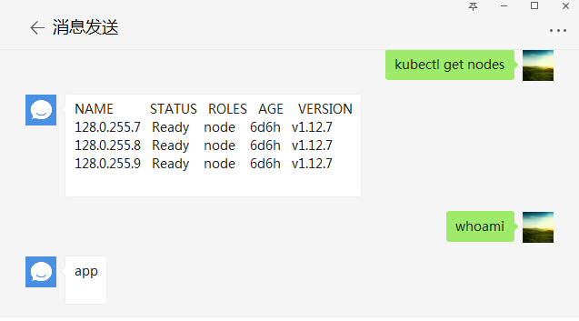
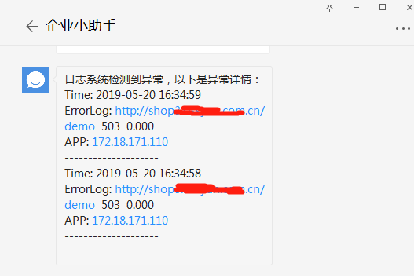

# Simple Aiohttp Application

## 概览
- /wechat

      实现发送消息到微信,在运行的服务器上执行命令，返回结果
    

    重启rabbitmq-prod集群

      cluster rabbitmq-prod restart
        
    回收O2O6的shop的应用池
    
      recycle O2O6 shop

    启动TEST02的指定进程

      run TEST02 windows
      
    重启`Docker`容器
    
      docker restart  containerName
        
    其他系统级别命令
    
      whoami
      ...

    
- /graylog

        Graylog的Alert告警回调
     
     
     *以上实现需要配合`GraylogStream`与`Graylog Alert`实现

     
## 运行

制作镜像

```bash
cd ProjectDir
# 以下两步不是必需，如果不需要则同时修改Dockerfile
cp -r /root/.kube  ./
cp `which kubectl` ./
docker build -t wechat .
```

准备docker-compose.yml

```yaml
aiohttp-ops:
  image: aiohttp
  container_name: aiohttp-ops
  volumes:
    - ./ansible_hosts:/etc/ansible/hosts
    - ./hosts:/etc/hosts
  environment:
    # 相关变量不需要加`"`双引号
    - WECHAT_CORPID=your_corpid
    - WECHAT_SECRET=your-secret
    - WECHAT_TOKEN=your-token
    - WECHAT_AESKEY=your-aeskey
    - WECHAT_ALLOW_USERS=user1,user2
    - WECHAT_NOTIFY_USERS=user1,user2
    - DDING_TOKEN=dingding-token
  restart: always
  net: host
```

运行

```bash
docker-compose up -d
```